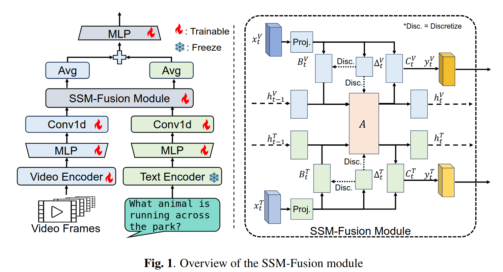

# Mamba Fusion (MambaVL) : Learning Actions Through Questioning (ICASSP 2025)

[](https://arxiv.org/pdf/2409.11513)

## News
- 20/12/2024: MambaVL has been accepted to ICASSP 2025.


## Overview

This is an official pytorch implementation of paper [Mamba Fusion: Learning Actions Through Questioning](https://arxiv.org/pdf/2409.11513). In this repository, we provide the PyTorch code we used to train and test our fusion method.

If you find our work useful in your research, please use the following BibTeX entry for citation.

```BibTeX
@article{dong2024mamba,
  title={Mamba Fusion: Learning Actions Through Questioning},
  author={Dong, Zhikang and Beedu, Apoorva and Sheinkopf, Jason and Essa, Irfan},
  journal={arXiv preprint arXiv:2409.11513},
  year={2024}
}
```


# Model Zoo


| name | dataset | Task | verb@1 | noun@1 | action@1 | url |
| --- | --- | --- | --- | --- | --- | --- |
| AVION_B | EK100 | Action recognition | 70.9 | 61.1 | 49.1 | [model](https://drive.google.com/file/d/1m9qJKRoxaK4uW0BoKrmrKh9LRjsPqdKE/view?usp=sharing) |
| AVION_L | EK100 | Action recognition | 74.3 | 67.1 | 55.0 | [model](https://drive.google.com/file/d/1JR1AJiB9Fw7-50vrudLmMPUvmzpZdO9W/view?usp=sharing) |
| ORViT-Motionformer | EK100 | Action Anticipation | 29.1 | 35.1 | 23.9 | [model](https://drive.google.com/drive/folders/1cI5VQoEO-W8OlA7QhceSeUpK-EJ6xeGJ?usp=sharing) |


# Installation

First, create a conda virtual environment and activate it:
```
conda create -n orvit python=3.8.5 -y
source activate orvit
```

Then, install the following packages:

- torchvision: `pip install torchvision` or `conda install torchvision -c pytorch`
- [fvcore](https://github.com/facebookresearch/fvcore/): `pip install 'git+https://github.com/facebookresearch/fvcore'`
- simplejson: `pip install simplejson`
- einops: `pip install einops`
- timm: `pip install timm`
- PyAV: `conda install av -c conda-forge`
- psutil: `pip install psutil`
- scikit-learn: `pip install scikit-learn`
- OpenCV: `pip install opencv-python`
- tensorboard: `pip install tensorboard`
- matplotlib: `pip install matplotlib`
- pandas: `pip install pandas`
- ffmeg: `pip install ffmpeg-python`
- Mamba: https://github.com/state-spaces/mamba 

OR:

simply create conda environment with all packages just from yaml file:

`conda env create -f environment.yml`

# Usage

## Dataset Preparation

Please use the dataset preparation instructions provided in [DATASET.md](slowfast/datasets/DATASET.md).

## Training the MambaVL
You may need to change the data paths in the config file.
Download the model [checkpoints](https://drive.google.com/drive/folders/1lPMcuHojidQFc-quBVIj7TNlbKwYXh1_?usp=sharing) and place them in the checkpoint folder. You may also need to download ORViT model's checkpoint from [here](https://github.com/eladb3/ORViT).

To train MambaVL with AVION as backbone, use the following command:

```
python tools/run_net.py \
  --cfg configs/ORViT/EK_ORVIT_MF_HR_AVION_cosine.yaml 
```


## Inference

Use `TRAIN.ENABLE` and `TEST.ENABLE` to control whether training or testing is required for a given run. When testing, you also have to provide the path to the checkpoint model via TEST.CHECKPOINT_FILE_PATH.
```
python tools/run_net.py \
  --cfg configs/ORViT/EK_ORVIT_MF_HR_AVION_cosine.yaml \
  TEST.CHECKPOINT_FILE_PATH path_to_your_checkpoint \
  TRAIN.ENABLE False 
```


# Acknowledgements

MambaVL is built on top of [ORViT](https://github.com/eladb3/ORViT), [Mamba](https://github.com/state-spaces/mamba) and [AVION](https://github.com/zhaoyue-zephyrus/AVION). We thank the authors for releasing their code. If you use our model, please consider citing these works as well:
```BibTeX

@misc{orvit2021,
      author={Roei Herzig and Elad Ben-Avraham and Karttikeya Mangalam and Amir Bar and Gal Chechik and Anna Rohrbach and Trevor Darrell and Amir Globerson},
      title={Object-Region Video Transformers},
      year={2021},
      eprint={2110.06915},
      archivePrefix={arXiv},
      primaryClass={cs.CV}
}
```

```BibTeX
@misc{fan2020pyslowfast,
  author =       {Haoqi Fan and Yanghao Li and Bo Xiong and Wan-Yen Lo and
                  Christoph Feichtenhofer},
  title =        {PySlowFast},
  howpublished = {\url{https://github.com/facebookresearch/slowfast}},
  year =         {2020}
}
```

```BibTeX
@article{zhao2023training,
  title={Training a large video model on a single machine in a day},
  author={Zhao, Yue and Kr{\"a}henb{\"u}hl, Philipp},
  journal={arXiv preprint arXiv:2309.16669},
  year={2023}
}
```
```BibTeX
@article{mamba,
  title={Mamba: Linear-Time Sequence Modeling with Selective State Spaces},
  author={Gu, Albert and Dao, Tri},
  journal={arXiv preprint arXiv:2312.00752},
  year={2023}
}

@inproceedings{mamba2,
  title={Transformers are {SSM}s: Generalized Models and Efficient Algorithms Through Structured State Space Duality},
  author={Dao, Tri and Gu, Albert},
  booktitle={International Conference on Machine Learning (ICML)},
  year={2024}
}
```